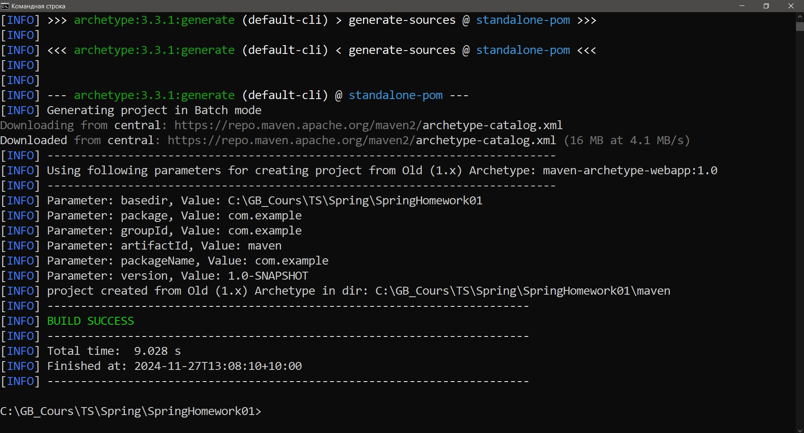
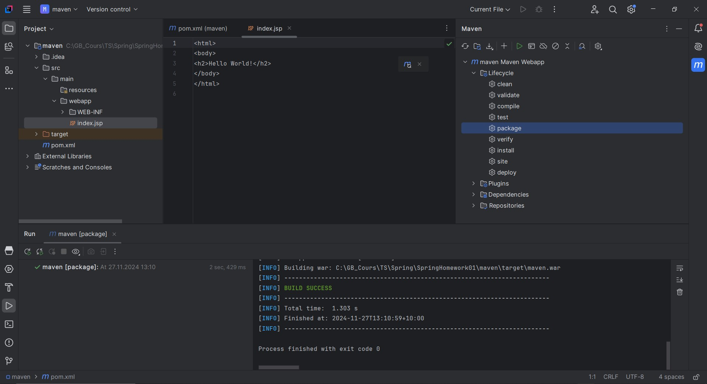
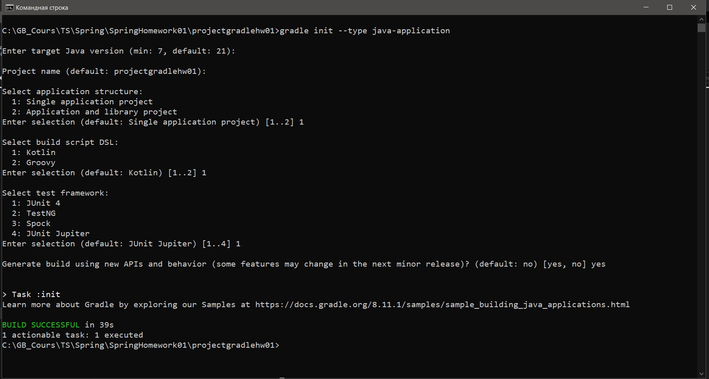
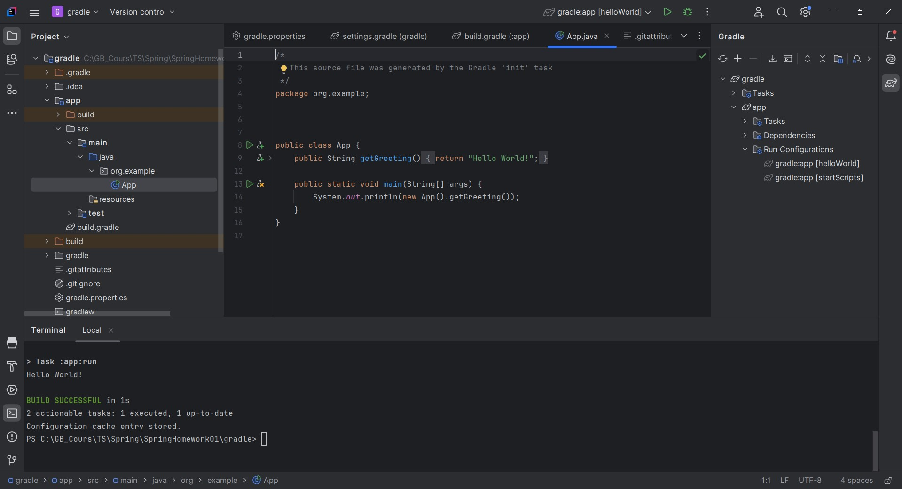

 # Урок 1. Системы сборки Maven и Gradle для разработки Java приложений
 
 ## Домашнее задание:

 Создайте простое веб-приложение с использованием Maven и Gradle. 
 Сравните их возможности и поделитесь своими мыслями.

-----------------------------------------------------------------------------------------
## Демонстрация решения:

Project Maven

------------------------------------

Project Gradle

